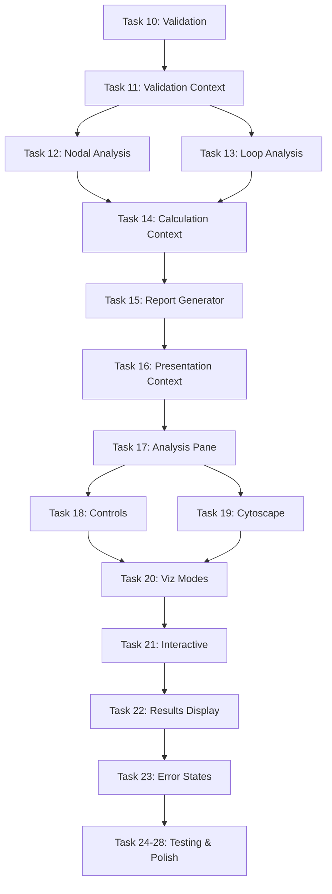

# Circuit Analysis App - Development Roadmap

## Visual Progress Tracker

```
Phase 1: Foundation & UI ████████████████████████████████ 100% ✅
Phase 2: Analysis Pipeline ░░░░░░░░░░░░░░░░░░░░░░░░░░░░   0% 🚧
Phase 3: Testing & Polish  ░░░░░░░░░░░░░░░░░░░░░░░░░░░░   0% ⏳

Overall Progress: ████████░░░░░░░░░░░░░░░░░░░░░░░░░░░░  32%
```

## Phase Breakdown

### Phase 1: Foundation & UI ✅ COMPLETED
**Duration:** ~4 weeks  
**Status:** All 9 tasks completed

```
✅ Task 1:  Dependencies & Types
✅ Task 2:  Zustand Store
✅ Task 3:  Three-Pane Layout
✅ Task 4:  Circuit Manager
✅ Task 5:  Custom Nodes (MUI)
✅ Task 6:  React Flow Editor
✅ Task 7:  Component Palette
✅ Task 8:  Editing Interactions
✅ Task 9:  Graph Transformer
```

**Key Deliverables:**
- Fully functional circuit editor
- Multi-circuit management
- Theme system (light/dark)
- Graph transformation utilities
- Spanning tree enumeration

---

### Phase 2: Analysis Pipeline 🚧 IN PROGRESS
**Duration:** ~3 weeks  
**Status:** 0/14 tasks completed

#### Week 1: Validation & Core Analysis
```
⏳ Task 10: Circuit Validation Logic
⏳ Task 11: Validation Context
⏳ Task 12: Nodal Analysis (Cut-Set)
⏳ Task 13: Loop Analysis (Tie-Set)
```

**Deliverables:**
- Circuit connectivity validation
- Source validation
- Loop/cut-set detection
- Nodal analysis with incidence matrix
- Loop analysis with tie-set matrix

#### Week 2: Calculation & Presentation
```
⏳ Task 14: Calculation Context
⏳ Task 15: Report Generator
⏳ Task 16: Presentation Context
⏳ Task 17: Analysis Pane Wrapper
```

**Deliverables:**
- On-demand calculation trigger
- LaTeX matrix formatting
- Markdown report generation
- Context pipeline integration

#### Week 3: Visualization
```
⏳ Task 18: Analysis Controls
⏳ Task 19: Cytoscape Graph
⏳ Task 20: Visualization Modes
⏳ Task 21: Interactive Features
```

**Deliverables:**
- Analysis toolbar with controls
- Cytoscape graph visualization
- 5 visualization modes (Graph, Tree, Loops, Cut-Sets, Results)
- Interactive highlighting and tooltips

#### Week 4: Results & Error Handling
```
⏳ Task 22: Results Display
⏳ Task 23: Error & Loading States
```

**Deliverables:**
- Markdown + KaTeX results display
- Error messages and warnings
- Loading spinners
- Empty states

---

### Phase 3: Testing & Polish ⏳ PENDING
**Duration:** ~1 week  
**Status:** 0/5 tasks completed

```
⏳ Task 24: Unit Tests
⏳ Task 25: Reference Circuits
⏳ Task 26: Performance Optimization
⏳ Task 27: UI Polish
⏳ Task 28: Final Integration
```

**Deliverables:**
- Comprehensive unit tests
- Reference test circuits with known solutions
- Performance optimizations
- Polished UI with accessibility
- Complete end-to-end testing

---

## Critical Path



## Milestone Targets

### Milestone 1: Validation Working ✅ Target: Week 1
- Circuit validation complete
- Validation context integrated
- Error messages displayed

### Milestone 2: Analysis Working ✅ Target: Week 2
- Nodal and loop analysis functional
- Calculation context integrated
- Basic results displayed

### Milestone 3: Visualization Working ✅ Target: Week 3
- Cytoscape graph rendering
- All 5 visualization modes working
- Interactive features functional

### Milestone 4: Complete UI ✅ Target: Week 4
- Results display with LaTeX
- Error handling complete
- Loading states implemented

### Milestone 5: Production Ready ✅ Target: Week 5
- All tests passing
- Performance optimized
- UI polished
- Documentation complete

## Risk Assessment

### High Risk Items
- **Matrix solving accuracy** - Need to verify against known solutions
- **Cytoscape styling** - Must match lecture visual conventions
- **Performance** - Large circuits (100+ nodes) may be slow

### Mitigation Strategies
- Use reference circuits for validation (Task 25)
- Reference `docs/lecturesImages/` for styling
- Implement performance optimizations early (Task 26)
- Profile matrix operations and optimize hot paths

## Dependencies

### External Dependencies (Already Installed)
- ✅ zustand - State management
- ✅ @xyflow/react - Circuit editor
- ✅ mathjs - Matrix operations
- ✅ react-resizable-panels - Layout
- ✅ react-markdown - Report display
- ✅ katex - LaTeX rendering
- ✅ cytoscape - Graph visualization
- ✅ @mui/material - UI components

### Internal Dependencies
- ✅ Circuit types defined
- ✅ Analysis types defined
- ✅ Store implemented
- ✅ Graph transformer implemented
- ⏳ Validation utilities (Task 10)
- ⏳ Analysis utilities (Tasks 12-13)
- ⏳ Report generator (Task 15)

## Success Criteria

### Phase 2 Complete When:
- [ ] User can run nodal analysis on any valid circuit
- [ ] User can run loop analysis on any valid circuit
- [ ] Results display with properly formatted LaTeX
- [ ] Graph shows all 5 visualization modes
- [ ] Validation errors are clear and actionable
- [ ] All matrix operations are correct (verified with test circuits)

### Phase 3 Complete When:
- [ ] All unit tests pass
- [ ] Reference circuits produce correct results
- [ ] Performance is acceptable (< 2s for 100-node circuits)
- [ ] UI is polished and accessible
- [ ] Code quality metrics met (CC < 10, no linting errors)
- [ ] Documentation is complete

### Project Complete When:
- [ ] All requirements from requirements.md are met
- [ ] All acceptance criteria are satisfied
- [ ] Application is production-ready
- [ ] User can analyze circuits end-to-end without issues

## Next Actions

### This Week (Week 1 of Phase 2)
1. **Monday-Tuesday:** Task 10 - Circuit Validation Logic
2. **Wednesday:** Task 11 - Validation Context
3. **Thursday-Friday:** Task 12 - Nodal Analysis

### Next Week (Week 2 of Phase 2)
1. **Monday-Tuesday:** Task 13 - Loop Analysis
2. **Wednesday:** Task 14 - Calculation Context
3. **Thursday-Friday:** Task 15 - Report Generator

### Following Weeks
- Week 3: Tasks 16-21 (Presentation & Visualization)
- Week 4: Tasks 22-23 (Results & Error Handling)
- Week 5: Tasks 24-28 (Testing & Polish)

## Resources

- **Design Document:** `.kiro/specs/circuit-analysis-app/design.md`
- **Requirements:** `.kiro/specs/circuit-analysis-app/requirements.md`
- **Tasks:** `.kiro/specs/circuit-analysis-app/tasks.md`
- **Refinement Summary:** `.kiro/specs/circuit-analysis-app/REFINEMENT_SUMMARY.md`
- **Lecture Images:** `docs/lecturesImages/`
- **Steering Docs:** `.kiro/steering/`

## Notes

- All Phase 1 refactoring has been completed following code quality standards
- Store uses branded types (CircuitId, NodeId, EdgeId)
- CircuitFlowContext is modular with extracted hooks
- Helper functions keep cyclomatic complexity low
- MUI components used throughout for consistent styling
- Theme system (light/dark) is fully functional

---

**Last Updated:** November 15, 2025  
**Current Focus:** Beginning Phase 2 - Task 10 (Circuit Validation Logic)
