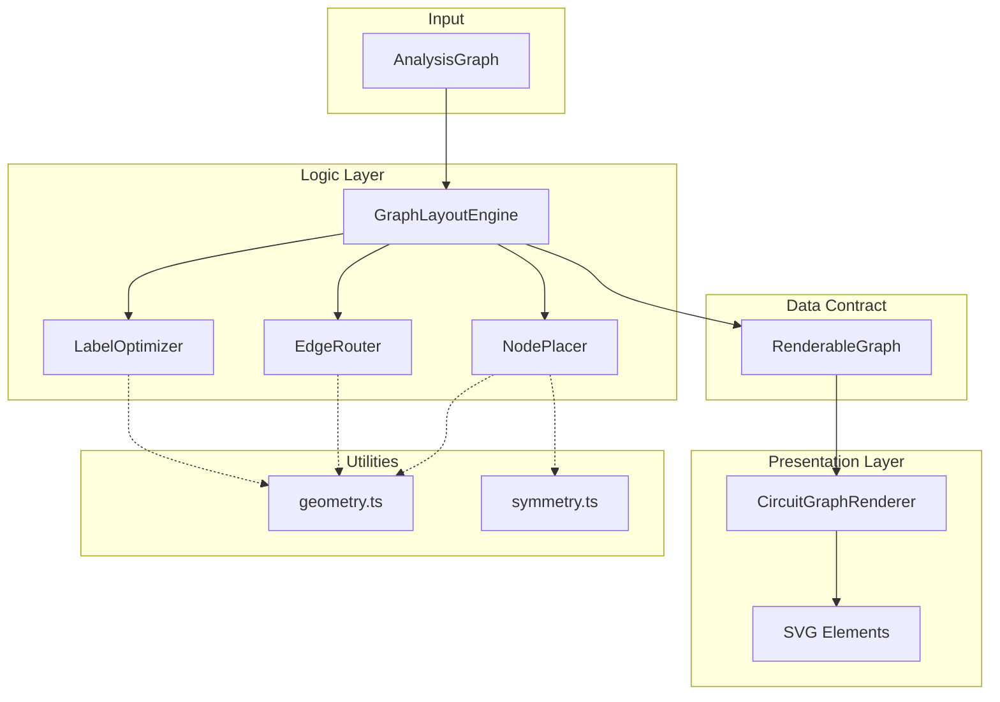
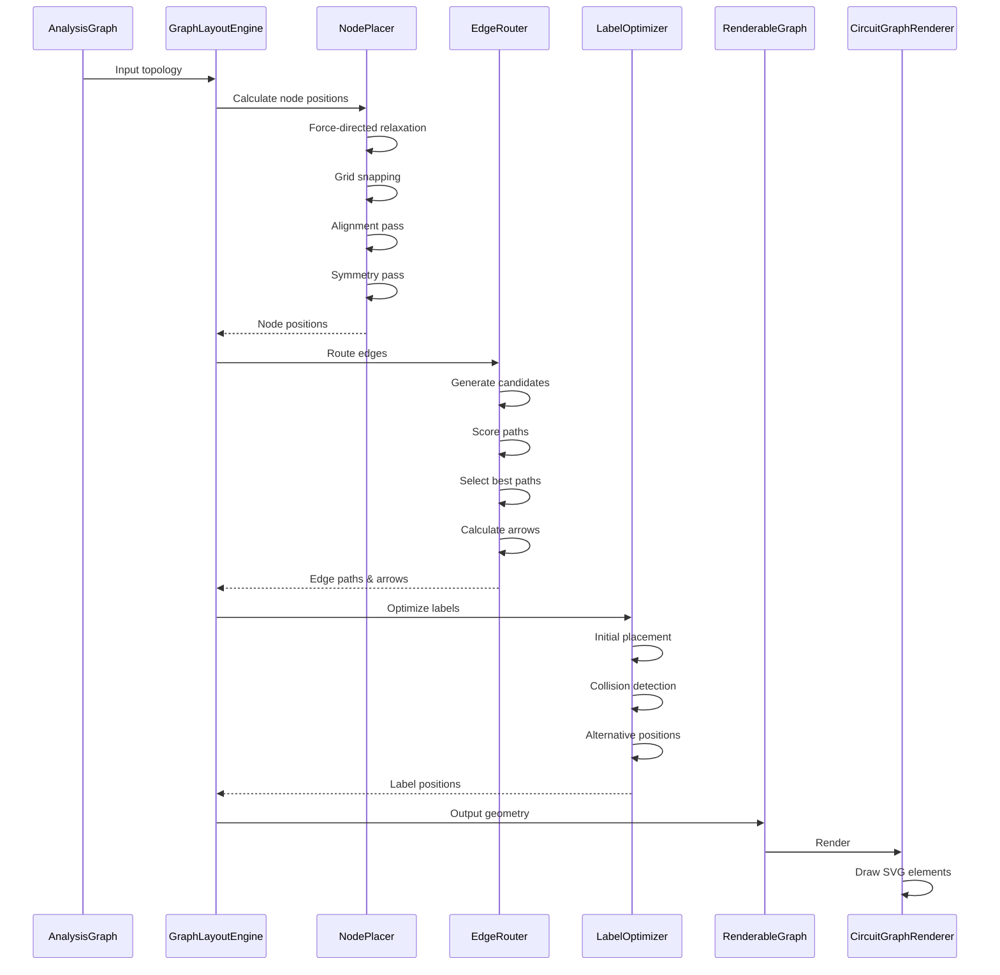

# Design Document

## Overview

The Circuit Graph Visualization feature implements a custom layout engine and SVG renderer to transform electrical circuit topology into textbook-quality graph visualizations. The system follows a clear separation between logic (layout calculation) and presentation (SVG rendering), with a multi-stage pipeline that optimizes node placement, edge routing, and label positioning.

The architecture consists of three main layers:

1. **Logic Layer** - GraphLayoutEngine with specialized modules (NodePlacer, EdgeRouter, LabelOptimizer)
2. **Data Contract Layer** - RenderableGraph data structure
3. **Presentation Layer** - CircuitGraphRenderer React component

This design ensures the system can generate deterministic, aesthetically pleasing graph layouts that adhere to strict visual specifications while remaining maintainable and testable.

## Architecture

### High-Level Component Diagram



### Data Flow Pipeline



## Components and Interfaces

### 1. GraphLayoutEngine

**Purpose**: Orchestrates the layout pipeline and transforms AnalysisGraph into RenderableGraph.

**Interface**:
```typescript
class GraphLayoutEngine {
  /**
   * Main entry point for layout calculation
   * @param graph - Circuit topology
   * @returns Geometric representation ready for rendering
   */
  calculateLayout(graph: AnalysisGraph): RenderableGraph;
  
  private nodePlacer: NodePlacer;
  private edgeRouter: EdgeRouter;
  private labelOptimizer: LabelOptimizer;
}
```

**Responsibilities**:
- Accept AnalysisGraph as input
- Delegate to NodePlacer for node positioning
- Delegate to EdgeRouter for edge path calculation
- Delegate to LabelOptimizer for label positioning
- Assemble final RenderableGraph
- Ensure pipeline executes in correct sequence

**Dependencies**: NodePlacer, EdgeRouter, LabelOptimizer

### 2. NodePlacer

**Purpose**: Calculate optimal node positions using hybrid force-grid algorithm.

**Interface**:
```typescript
interface NodePlacementResult {
  positions: Map<NodeId, { x: number; y: number }>;
  bounds: { width: number; height: number };
}

class NodePlacer {
  /**
   * Calculate node positions with force-directed + grid-snap approach
   * @param nodes - Electrical nodes from graph
   * @param branches - Branches defining connectivity
   * @returns Node positions and layout bounds
   */
  placeNodes(
    nodes: ElectricalNode[],
    branches: Branch[]
  ): NodePlacementResult;
  
  private applyForceDirected(
    nodes: ElectricalNode[],
    branches: Branch[]
  ): Map<NodeId, { x: number; y: number }>;
  
  private snapToGrid(
    positions: Map<NodeId, { x: number; y: number }>,
    gridSize: number
  ): Map<NodeId, { x: number; y: number }>;
  
  private alignNodes(
    positions: Map<NodeId, { x: number; y: number }>,
    threshold: number
  ): Map<NodeId, { x: number; y: number }>;
  
  private enforceSymmetry(
    positions: Map<NodeId, { x: number; y: number }>,
    nodes: ElectricalNode[],
    branches: Branch[]
  ): Map<NodeId, { x: number; y: number }>;
}
```

**Algorithm**:

1. **Phase A: Force-Directed Relaxation**
   - Initialize nodes at random positions
   - Apply centering force to pull nodes toward center
   - Apply link force between connected nodes (preferred length: 100-150px)
   - Apply repulsion force between all nodes
   - Iterate until energy stabilizes (max 300 iterations)

2. **Phase B: Grid Snapping**
   - Quantize all coordinates to grid (e.g., 50px units)
   - Round x and y to nearest grid point

3. **Phase C: Alignment Pass**
   - Detect nodes with similar x-coordinates (within threshold)
   - Snap to common vertical axis
   - Detect nodes with similar y-coordinates (within threshold)
   - Snap to common horizontal axis

4. **Phase D: Symmetry Pass**
   - Detect isomorphic sub-graphs using graph matching
   - Calculate central axis
   - Mirror sub-graph positions relative to axis

**Dependencies**: geometry.ts, symmetry.ts

### 3. EdgeRouter

**Purpose**: Calculate optimal edge paths using path scoring system.

**Interface**:
```typescript
interface EdgeRoutingResult {
  path: string; // SVG path data
  arrowPoint: { x: number; y: number; angle: number };
  isCurved: boolean;
}

interface PathCandidate {
  path: string;
  score: number;
  isCurved: boolean;
}

class EdgeRouter {
  /**
   * Route all edges with intelligent path selection
   * @param branches - Branches to route
   * @param nodePositions - Calculated node positions
   * @returns Edge paths with arrow positions
   */
  routeEdges(
    branches: Branch[],
    nodePositions: Map<NodeId, { x: number; y: number }>
  ): Map<BranchId, EdgeRoutingResult>;
  
  private generateCandidates(
    from: { x: number; y: number },
    to: { x: number; y: number }
  ): PathCandidate[];
  
  private scorePath(
    candidate: PathCandidate,
    existingElements: Array<RenderableNode | RenderableEdge>
  ): number;
  
  private calculateArrowPoint(
    path: string,
    t: number
  ): { x: number; y: number; angle: number };
}
```

**Algorithm**:

1. **Generate Candidates**
   - Path A: Direct straight line
   - Path B: Low-arc curve (CW, control point offset +30px perpendicular)
   - Path C: Low-arc curve (CCW, control point offset -30px perpendicular)
   - Path D: High-arc curve (control point offset +60px perpendicular)

2. **Score Each Candidate**
   ```
   score = intersectionPenalty + proximityPenalty + curvaturePenalty - symmetryBonus
   
   where:
   - intersectionPenalty = 1000 * (number of intersections with nodes/edges)
   - proximityPenalty = 100 * (number of pixels within 5px of other elements)
   - curvaturePenalty = 10 (if curved), 0 (if straight)
   - symmetryBonus = 50 (if mirrors partner edge), 0 (otherwise)
   ```

3. **Select Best Path**
   - Choose candidate with lowest score
   - If tie, prefer straight over curved

4. **Calculate Arrow**
   - Evaluate path at t=0.5 to get midpoint
   - Calculate tangent vector at t=0.5
   - Derive angle: `theta = atan2(dy, dx)`

**Dependencies**: geometry.ts

### 4. LabelOptimizer

**Purpose**: Position labels to avoid overlaps and maintain clarity.

**Interface**:
```typescript
interface LabelPosition {
  x: number;
  y: number;
}

class LabelOptimizer {
  /**
   * Optimize label positions to avoid collisions
   * @param nodes - Renderable nodes needing labels
   * @param edges - Renderable edges needing labels
   * @returns Optimized label positions
   */
  optimizeLabels(
    nodes: RenderableNode[],
    edges: RenderableEdge[]
  ): {
    nodeLabels: Map<string, LabelPosition>;
    edgeLabels: Map<string, LabelPosition>;
  };
  
  private calculateInitialPosition(
    element: RenderableNode | RenderableEdge,
    offset: number
  ): LabelPosition;
  
  private detectCollision(
    labelBounds: BoundingBox,
    existingElements: Array<RenderableNode | RenderableEdge | LabelPosition>
  ): boolean;
  
  private findAlternativePosition(
    element: RenderableNode | RenderableEdge,
    existingElements: Array<RenderableNode | RenderableEdge | LabelPosition>
  ): LabelPosition;
}
```

**Algorithm**:

1. **Initial Placement**
   - For nodes: offset 10px above node center
   - For edges: offset 10px above edge midpoint

2. **Collision Detection**
   - Calculate bounding box for label text
   - Check intersection with all existing elements
   - If collision detected, proceed to step 3

3. **Alternative Positions**
   - Try positions in order: Below, Start-Third, End-Third
   - For each position, check for collisions
   - Select first position with zero collisions

4. **Fallback**
   - If all positions collide, select position with minimum overlap area

**Dependencies**: geometry.ts

### 5. CircuitGraphRenderer

**Purpose**: Render RenderableGraph as SVG elements.

**Interface**:
```typescript
interface CircuitGraphRendererProps {
  graph: RenderableGraph;
  selectedTreeId?: TreeId;
  onNodeClick?: (nodeId: NodeId) => void;
  onEdgeClick?: (branchId: BranchId) => void;
}

const CircuitGraphRenderer: React.FC<CircuitGraphRendererProps> = ({
  graph,
  selectedTreeId,
  onNodeClick,
  onEdgeClick
}) => {
  // Render SVG
};
```

**Rendering Strategy**:

1. **SVG Container**
   - Set viewBox based on graph width/height
   - Add zoom/pan support (optional)

2. **Render Edges**
   - For each RenderableEdge:
     - Create `<path>` with d attribute from edge.path
     - Apply stroke style (solid for twigs, dashed for links)
     - Add arrow marker at edge.arrowPoint
     - Add text label at edge.labelPos

3. **Render Nodes**
   - For each RenderableNode:
     - Create `<circle>` at (x, y) with small radius
     - Add text label at node.labelPos

4. **Styling**
   - Nodes: fill="#000", radius="3"
   - Edges: stroke="#000", stroke-width="2"
   - Twigs: stroke-dasharray="none"
   - Links: stroke-dasharray="5,5"
   - Labels: font-family="sans-serif", font-size="12" (nodes), "14" (edges)

**Dependencies**: React, RenderableGraph type

### 6. Utility Modules

#### geometry.ts

**Purpose**: Pure geometric calculation functions.

**Interface**:
```typescript
// Line-line intersection
export function getLineIntersection(
  line1: { start: Point; end: Point },
  line2: { start: Point; end: Point }
): Point | undefined;

// Line-circle intersection
export function getLineCircleIntersection(
  line: { start: Point; end: Point },
  circle: { center: Point; radius: number }
): Point[] | undefined;

// Point on Bezier curve
export function getBezierPoint(
  start: Point,
  control: Point,
  end: Point,
  t: number
): Point;

// Tangent on Bezier curve
export function getBezierTangent(
  start: Point,
  control: Point,
  end: Point,
  t: number
): { dx: number; dy: number };

// Distance from point to line segment
export function pointToLineDistance(
  point: Point,
  line: { start: Point; end: Point }
): number;

// Bounding box intersection
export function boundingBoxIntersects(
  box1: BoundingBox,
  box2: BoundingBox
): boolean;
```

#### symmetry.ts

**Purpose**: Detect graph symmetries and isomorphisms.

**Interface**:
```typescript
// Detect isomorphic sub-graphs
export function findIsomorphicSubgraphs(
  nodes: ElectricalNode[],
  branches: Branch[]
): Array<{ nodes: NodeId[]; branches: BranchId[] }>;

// Calculate central axis for mirroring
export function calculateCentralAxis(
  positions: Map<NodeId, { x: number; y: number }>
): { type: 'vertical' | 'horizontal'; position: number };

// Mirror positions relative to axis
export function mirrorPositions(
  positions: Map<NodeId, { x: number; y: number }>,
  axis: { type: 'vertical' | 'horizontal'; position: number }
): Map<NodeId, { x: number; y: number }>;
```

## Data Models

### Input: AnalysisGraph

```typescript
export type NodeId = string & { readonly __brand: "NodeId" };
export type BranchId = string & { readonly __brand: "BranchId" };
export type TreeId = string & { readonly __brand: "TreeId" };

export interface ElectricalNode {
  id: NodeId;
  connectedBranchIds: BranchId[];
}

export interface Branch {
  id: BranchId;
  type: "resistor" | "voltageSource" | "currentSource";
  value: number;
  fromNodeId: NodeId;
  toNodeId: NodeId;
}

export interface SpanningTree {
  id: TreeId;
  twigBranchIds: BranchId[];
  linkBranchIds: BranchId[];
  description?: string;
}

export interface AnalysisGraph {
  nodes: ElectricalNode[];
  branches: Branch[];
  referenceNodeId: NodeId;
  allSpanningTrees: SpanningTree[];
  selectedTreeId: TreeId;
}
```

### Output: RenderableGraph

```typescript
export interface RenderableGraph {
  width: number;
  height: number;
  nodes: RenderableNode[];
  edges: RenderableEdge[];
}

export interface RenderableNode {
  id: string;
  x: number;
  y: number;
  label: string;
  labelPos: { x: number; y: number };
}

export interface RenderableEdge {
  id: string;
  sourceId: string;
  targetId: string;
  path: string; // SVG path data
  arrowPoint: { x: number; y: number; angle: number };
  label: string;
  labelPos: { x: number; y: number };
  isCurved: boolean;
}
```

### Supporting Types

```typescript
export interface Point {
  x: number;
  y: number;
}

export interface BoundingBox {
  x: number;
  y: number;
  width: number;
  height: number;
}
```

## Error Handling

### Validation Errors

**Scenario**: Invalid AnalysisGraph input (missing nodes, disconnected branches, etc.)

**Handling**:
- GraphLayoutEngine validates input before processing
- Throws descriptive error: `InvalidGraphError`
- Error message includes specific validation failure
- Caller (AnalysisPane) displays error to user

### Layout Failures

**Scenario**: Force-directed algorithm fails to converge

**Handling**:
- NodePlacer sets maximum iteration limit (300)
- If not converged, use best-effort positions
- Log warning to console
- Continue with layout pipeline

### Path Scoring Failures

**Scenario**: All path candidates have high penalty scores

**Handling**:
- EdgeRouter selects lowest-score candidate regardless
- May result in suboptimal routing
- Log warning for debugging
- Graph still renders (degraded quality acceptable)

### Label Collision Failures

**Scenario**: No collision-free position found for label

**Handling**:
- LabelOptimizer selects position with minimum overlap
- Log warning for debugging
- Label renders with partial overlap (acceptable)

### Rendering Errors

**Scenario**: Invalid SVG path data or React rendering error

**Handling**:
- CircuitGraphRenderer wrapped in ErrorBoundary
- Display fallback UI: "Graph visualization unavailable"
- Log error details for debugging
- Provide retry button to re-trigger layout

## Testing Strategy

### Unit Tests

**NodePlacer**:
- Test force-directed convergence with simple graphs (3-5 nodes)
- Test grid snapping with known positions
- Test alignment detection and snapping
- Test symmetry detection with mirror graphs

**EdgeRouter**:
- Test candidate generation for various node positions
- Test path scoring with known obstacles
- Test arrow calculation at t=0.5
- Test parallel edge handling

**LabelOptimizer**:
- Test initial position calculation
- Test collision detection with overlapping elements
- Test alternative position selection
- Test fallback behavior

**Geometry Utilities**:
- Test line-line intersection (parallel, intersecting, non-intersecting)
- Test Bezier point calculation at various t values
- Test tangent calculation
- Test distance calculations

### Integration Tests

**GraphLayoutEngine**:
- Test full pipeline with simple circuit (2 nodes, 1 resistor)
- Test with complex circuit (5+ nodes, multiple branches)
- Test with parallel branches
- Test with current sources (removed from graph)
- Verify RenderableGraph structure

**CircuitGraphRenderer**:
- Test rendering with minimal RenderableGraph
- Test spanning tree styling (twigs vs links)
- Test click handlers
- Test with empty graph

### Visual Regression Tests

- Capture SVG output for standard test circuits
- Compare against baseline images
- Flag layout changes for manual review
- Test cases:
  - Simple series circuit
  - Parallel branches
  - Bridge circuit (symmetry test)
  - Star topology (radial symmetry test)
  - Non-planar graph (intersection test)

### Performance Tests

- Measure layout time for graphs of varying sizes:
  - Small: 5 nodes, 7 branches
  - Medium: 20 nodes, 30 branches
  - Large: 50 nodes, 75 branches
- Target: < 100ms for small, < 500ms for medium, < 2s for large
- Profile force-directed iterations
- Profile path scoring loops

## Performance Considerations

### Optimization Strategies

1. **Force-Directed Algorithm**
   - Use Barnes-Hut approximation for large graphs (O(n log n) instead of O(n²))
   - Early termination when energy delta < threshold
   - Adaptive cooling schedule

2. **Path Scoring**
   - Spatial indexing (quadtree) for proximity checks
   - Cache intersection calculations
   - Limit candidate paths to 4 per edge

3. **Label Optimization**
   - Process labels in order of importance (nodes first, then edges)
   - Use bounding box approximations before precise collision checks
   - Limit alternative positions to 4 per label

4. **Rendering**
   - Memoize CircuitGraphRenderer with React.memo
   - Use useMemo for expensive SVG path calculations
   - Virtualize for very large graphs (render only visible elements)

### Memory Management

- Reuse Point and BoundingBox objects where possible
- Clear intermediate data structures after each pipeline stage
- Use WeakMap for caching when appropriate

## Integration Points

### With AnalysisPane

**Location**: `src/components/AnalysisPane/AnalysisPane.tsx`

**Integration**:
```typescript
import { CircuitGraphRenderer } from './CircuitGraphEngine';
import { GraphLayoutEngine } from './CircuitGraphEngine/engine/GraphLayoutEngine';

const AnalysisPane: React.FC = () => {
  const analysisGraph = useMemo(() => {
    // Convert circuit to AnalysisGraph
    return convertCircuitToGraph(circuit);
  }, [circuit]);
  
  const renderableGraph = useMemo(() => {
    const engine = new GraphLayoutEngine();
    return engine.calculateLayout(analysisGraph);
  }, [analysisGraph]);
  
  return (
    <div>
      <CircuitGraphRenderer
        graph={renderableGraph}
        selectedTreeId={analysisGraph.selectedTreeId}
        onNodeClick={handleNodeClick}
        onEdgeClick={handleEdgeClick}
      />
    </div>
  );
};
```

### With PresentationContext

**Location**: `src/contexts/PresentationContext/PresentationContext.tsx`

**Integration**:
- PresentationContext generates AnalysisGraph from circuit data
- Passes AnalysisGraph to AnalysisPane
- AnalysisPane uses GraphLayoutEngine to create RenderableGraph
- CircuitGraphRenderer displays the result

### File System Integration

**New Directory**: `src/components/AnalysisPane/CircuitGraphEngine/`

**Files to Create**:
```
src/components/AnalysisPane/CircuitGraphEngine/
├── index.tsx                      # Exports CircuitGraphRenderer
├── CircuitGraphRenderer.tsx       # React component
├── types.ts                       # RenderableGraph types
├── engine/
│   ├── GraphLayoutEngine.ts       # Main orchestrator
│   ├── NodePlacer.ts              # Node positioning
│   ├── EdgeRouter.ts              # Edge routing
│   └── LabelOptimizer.ts          # Label positioning
└── utils/
    ├── geometry.ts                # Geometric calculations
    └── symmetry.ts                # Symmetry detection
```

## Technology Stack

- **Language**: TypeScript with strict type checking
- **Framework**: React 19.2.0
- **Rendering**: Pure SVG (no external graph libraries)
- **Math**: Custom utilities (no mathjs dependency for this feature)
- **State Management**: Props-based (no Zustand needed for rendering)
- **Testing**: Vitest for unit tests, React Testing Library for component tests

## Design Decisions and Rationales

### Why Custom Layout Engine?

**Decision**: Implement custom layout engine instead of using existing graph libraries (Cytoscape, D3, etc.)

**Rationale**:
- Existing libraries don't support the specific "straight-if-possible, curve-if-blocked" routing logic
- Need precise control over symmetry and alignment for textbook quality
- Path scoring system is domain-specific and not available in standard libraries
- Custom implementation allows optimization for electrical circuit topology

### Why Hybrid Force-Grid Approach?

**Decision**: Combine force-directed algorithm with grid snapping and alignment

**Rationale**:
- Pure force-directed produces organic but "wobbly" layouts
- Pure grid-based produces rigid but unnatural layouts
- Hybrid approach gets best of both: natural topology with clean alignment
- Matches textbook diagram aesthetics

### Why Three-Layer Architecture?

**Decision**: Separate Logic (Engine), Data Contract (RenderableGraph), and Presentation (Renderer)

**Rationale**:
- Clear separation of concerns
- Engine can be tested without React
- Renderer can be tested with mock data
- Easy to swap rendering technology (Canvas, WebGL) without changing logic
- RenderableGraph serves as stable API contract

### Why Path Scoring Instead of Constraint Solving?

**Decision**: Use penalty-based scoring instead of constraint satisfaction

**Rationale**:
- Constraint solving (SAT, CSP) is computationally expensive
- Path scoring is fast and produces good-enough results
- Scoring allows graceful degradation (best effort)
- Easy to tune penalties for different visual priorities

### Why Pre-calculate Label Positions?

**Decision**: Calculate label positions in LabelOptimizer, not in renderer

**Rationale**:
- Keeps renderer pure and stateless
- Label positions are part of layout, not presentation
- Easier to test label collision logic
- Renderer just draws, doesn't compute

## Future Enhancements

### Phase 2 Features

1. **Interactive Layout Adjustment**
   - Allow user to drag nodes
   - Re-route edges dynamically
   - Persist custom layouts

2. **Animation**
   - Animate layout transitions
   - Highlight current flow paths
   - Animate spanning tree selection changes

3. **Export**
   - Export as PNG/SVG file
   - Copy to clipboard
   - Include in analysis reports

4. **Advanced Routing**
   - Orthogonal edge routing (Manhattan routing)
   - Multi-segment edges with waypoints
   - Edge bundling for dense graphs

5. **Performance Optimization**
   - Web Worker for layout calculation
   - Incremental layout updates
   - Level-of-detail rendering for large graphs

### Accessibility Considerations

- Add ARIA labels to SVG elements
- Support keyboard navigation (tab through nodes/edges)
- Provide text-based alternative representation
- Ensure sufficient color contrast for labels
- Support screen reader announcements for graph structure
